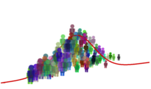

  

### Citation

Lui, K. K., Nunez, M. D., Cassidy, J. M., Vandekerckhove, J., Cramer, S. C., & Srinivasan, R. (2020).
[Timing of readiness potentials reflect a decision-making process in the human brain.](https://sci-hub.st/https://link.springer.com/article/10.1007/s42113-020-00097-5) Computational Brain & Behavior.

[Preprint](https://www.biorxiv.org/content/10.1101/338806v3)

[Springer source](https://link.springer.com/article/10.1007/s42113-020-00097-5)

# RPDecision
#### (Repository version 0.2.4)
Timing of readiness potentials reflect a decision-making process in the human brain

**Authors: Kitty K. Lui, Michael D. Nunez, Jessica M. Cassidy, Joachim Vandekerckhove, Steven C. Cramer, and Ramesh Srinivasan at the University of California, Irvine**

### Prerequisites

[MATLAB](https://www.mathworks.com/)

[MATLAB Repository: artscreenEEG](https://github.com/mdnunez/artscreenEEG)

[MCMC Sampling Program: JAGS](http://mcmc-jags.sourceforge.net/)

[Program: JAGS Wiener module](https://sourceforge.net/projects/jags-wiener/)

[MATLAB Repository Trinity for calling JAGS from MATLAB](https://github.com/joachimvandekerckhove/trinity)

### Downloading

The repository can be cloned with `git clone https://github.com/mdnunez/RPDecision.git`

The repository can also be may download via the _Download zip_ button above.

### License

RPDecision is licensed under the MIT License and written by Kitty K. Lui, Michael D. Nunez, Jessica M. Cassidy, Joachim Vandekerckhove, Steven C. Cramer, and Ramesh Srinivasan at the University of California, Irvine

### Further Reading

Nunez, M. D., Gosai, A., Vandekerckhove, J., & Srinivasan, R. (2019).
[The latency of a visual evoked potential tracks the onset of decision making.](https://sci-hub.st/https://www.sciencedirect.com/science/article/pii/S1053811919303386) NeuroImage. doi: 10.1016/j.neuroimage.2019.04.052

Nunez, M. D., Vandekerckhove, J., & Srinivasan, R. (2017).
[How attention influences perceptual decision making: Single-trial EEG correlates of drift-diffusion model parameters.](https://sci-hub.st/https://www.sciencedirect.com/science/article/abs/pii/S0022249616000316)
Journal of Mathematical Psychology, 76, 117-130.

Nunez, M. D., Srinivasan, R., & Vandekerckhove, J. (2015). 
[Individual differences in attention influence perceptual decision making.](https://www.frontiersin.org/articles/10.3389/fpsyg.2015.00018/full) 
Frontiers in Psychology, 8.

### EEG Data

Artifact-correct EEG data from this study is available upon request.

